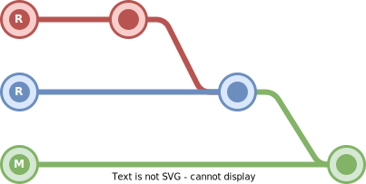

# CASCADE-MERGE-APP

Automatically cascade changes to newer release branches and reduce the need for manual branch maintenance.

This GitHub App is based on Bitbucket's [**Cascade Merge**](https://confluence.atlassian.com/bitbucketserver/automatic-branch-merging-776639993.html) feature and preserves the exact branch ordering algorithm to ensure semantic versioning compatibility.

> **🚀 New here?** Check out the [Quick Start Guide](docs/QUICKSTART.md) to get running in under 10 minutes!

## 🚀 Features

- **Automatic Cascade Merging**: When a PR is merged to a release branch, automatically creates PRs to merge into all subsequent branches
- **Semantic Version Ordering**: Uses Bitbucket's proven algorithm to correctly order branches with complex versioning (e.g., `1.1-rc1`, `1.2-a`, `2.0`)
- **Repository-Scoped Configuration**: Each repository controls its own cascade rules via `.github/cascading-merge.yml`
- **Error Handling**: Gracefully handles merge conflicts, duplicate PRs, and API errors
- **Issue Tracking**: Automatically creates issues for manual intervention when needed

## 📋 Prerequisites

- Node.js >= 20
- A GitHub organization or repository where you have admin access
- GitHub App credentials (see Installation section)

## 🔧 Installation

### Quick Install (Automated)

```bash
# Clone and install
git clone https://github.com/YOUR_ORG/cascading-merge-app.git
cd cascading-merge-app
npm install

# Run automated setup
npm run setup
```

Then open `http://localhost:3333` in your browser and follow the instructions to create your GitHub App automatically!

### Manual Install

For step-by-step manual setup instructions, see the **[Installation Guide](docs/INSTALLATION.md)**.

### What You Need

- Node.js 20+ and npm 8+
- Admin access to a GitHub organization or repository
- 5-10 minutes for setup

## 🎯 Usage

### Running Locally (Development)

1. Start the webhook proxy (if using smee.io):
   ```bash
   npx smee -u https://smee.io/your-unique-url -t http://localhost:3000
   ```

2. In another terminal, start the app:
   ```bash
   npm run dev
   ```

The app will now listen for webhook events and process cascade merges.

### Running in Production

```bash
npm start
```

For production deployment, consider:
- Using a process manager like PM2
- Setting up HTTPS with a reverse proxy (nginx/Apache)
- Storing the private key as an environment variable instead of a file
- Using systemd or Docker for service management

## ⚙️ Repository Configuration

Each repository needs a `.github/cascading-merge.yml` file to enable cascade merging:

```yaml
# Branch prefixes to cascade
prefixes:
  - 'release/'
  - 'hotfix/'

# The final branch to merge into
ref_branch: 'main'
```

### Example Workflow

With this configuration and branches:
- `release/1.0`
- `release/1.1`
- `release/2.0`
- `main`

When a PR is merged into `release/1.0`, the app will:
1. Create a PR from `release/1.0` → `release/1.1`
2. Auto-merge if no conflicts
3. Create a PR from `release/1.1` → `release/2.0`
4. Auto-merge if no conflicts
5. Create a PR from `release/2.0` → `main`
6. Auto-merge if no conflicts

If any merge fails due to conflicts, it:
- Stops the cascade at that point
- Creates an issue assigning the PR author
- Adds a comment to the original PR

### Missing Configuration Behavior

By default, if a repository doesn't have a `.github/cascading-merge.yml` file, the app will use default settings (`prefixes: ['release/']`, `ref_branch: 'develop'`).

For **multi-repository installations**, you can control this behavior with the `MISSING_CONFIG_BEHAVIOR` environment variable:

```bash
# Option 1: Skip repos without config (recommended for org-wide installations)
MISSING_CONFIG_BEHAVIOR=skip

# Option 2: Use defaults for repos without config (current default)
MISSING_CONFIG_BEHAVIOR=use-defaults
```

**When to use `skip`:**
- Installing the app across multiple repositories in an organization
- Only want cascade merge on repos that explicitly opt-in with a config file
- Avoid unintended cascades on repos without proper configuration

**When to use `use-defaults`:**
- Single repository installation
- All repos in your org use the same cascade pattern
- Want immediate cascade functionality without configuration files

## 🧪 Testing

Run the test suite:

```bash
npm test
```

Run tests in watch mode:

```bash
npm test -- --watch
```

## 📖 Documentation

Complete documentation suite:

| Document | Description |
|----------|-------------|
| **[Quick Start Guide](docs/QUICKSTART.md)** | ⚡ Get running in 10 minutes |
| **[Installation Guide](docs/INSTALLATION.md)** | 📦 Automated & manual setup |
| **[Configuration Guide](#️-repository-configuration)** | ⚙️ Configure cascade behavior |
| **[Deployment Guide](docs/DEPLOYMENT.md)** | 🚀 Production deployment (Docker, Cloud platforms) |
| **[Troubleshooting Guide](docs/TROUBLESHOOTING.md)** | 🐛 Common issues and solutions |
| **[Contributing Guide](CONTRIBUTING.md)** | 🤝 How to contribute |
| **[Architecture Decisions](docs/adr-001-github-app-architecture.md)** | 🏗️ Technical design decisions |
| **[Changelog](CHANGELOG.md)** | 📝 Version history |
| **[License](LICENSE)** | ⚖️ MIT License |

## 🏗️ Architecture

See [docs/adr-001-github-app-architecture.md](docs/adr-001-github-app-architecture.md) for detailed architecture decisions.

### Key Components

- **[src/index.ts](src/index.ts)**: Main Probot app entry point with webhook handlers
- **[src/lib/cascading-branch-merge.ts](src/lib/cascading-branch-merge.ts)**: Core cascade logic (translated from original Action)
- **[src/lib/config.ts](src/lib/config.ts)**: Configuration loading and validation
- **[src/types/config.ts](src/types/config.ts)**: TypeScript interfaces

## 🛠️ Development

### Project Scripts

```bash
npm run build        # Compile TypeScript to JavaScript
npm run dev          # Run with auto-reload (nodemon)
npm start            # Run the production build
npm test             # Run tests
npm run lint         # Lint code with ESLint
npm run format       # Format code with Prettier
npm run format:check # Check code formatting
```

### Debugging

Enable debug logging by setting:

```bash
LOG_LEVEL=debug npm run dev
```

## 🤝 Contributing

Contributions are welcome! Please read [CONTRIBUTING.md](CONTRIBUTING.md) for details on:

- Development workflow
- Code style and testing guidelines
- Pull request process
- Project structure

Quick start for contributors:

1. Fork the repository
2. Create a feature branch (`git checkout -b feature/amazing-feature`)
3. Make your changes and add tests
4. Ensure tests pass: `npm test`
5. Commit your changes (`git commit -m 'feat: add amazing feature'`)
6. Push to the branch (`git push origin feature/amazing-feature`)
7. Open a Pull Request

## 📄 License

This project is licensed under the MIT License - see the [LICENSE](LICENSE) file for details.

## 🐛 Troubleshooting

Encountering issues? Check the [TROUBLESHOOTING.md](docs/TROUBLESHOOTING.md) guide for solutions to common problems:

- Installation and configuration issues
- Webhook problems
- API rate limiting
- Merge failures
- Performance optimization

## 🚀 Deployment

For production deployment instructions, see [DEPLOYMENT.md](docs/DEPLOYMENT.md) which covers:

- Docker deployment
- Cloud platform deployments (Heroku, Azure, AWS, GCP)
- Security best practices
- Monitoring and logging
- Scaling considerations

## 📚 References

- [Probot Documentation](https://probot.github.io/docs/)
- [Bitbucket Cascade Merge](https://confluence.atlassian.com/bitbucketserver/automatic-branch-merging-776639993.html)
- [Original GitHub Action](https://github.com/ActionsDesk/cascading-downstream-merge)
