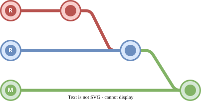

# CASCADE-MERGE-APP

[](https://github.com/jefeish/cascading-merge-app/actions/workflows/test.yml)

Automatically cascade changes to newer release branches and reduce the need for manual branch maintenance.

This GitHub App is based on Bitbucket's [**Cascade Merge**](https://confluence.atlassian.com/bitbucketserver/automatic-branch-merging-776639993.html) feature and preserves the exact branch ordering algorithm to ensure semantic versioning compatibility.

> **📦 Built with Probot**: This app uses the [Probot](https://probot.github.io/) framework for GitHub Apps. For advanced configuration options and framework-specific details, refer to the [Probot documentation](https://probot.github.io/docs/).

> **⚡ Get Started in 5 Minutes**: [Quick Start Guide →](docs/QUICKSTART.md)

## 🚀 Features

- **Automatic Cascade Merging**: When a PR is merged to a release branch, automatically creates PRs to merge into all subsequent branches
- **Semantic Version Ordering**: Uses Bitbucket's proven algorithm to correctly order branches with complex versioning (e.g., `1.1-rc1`, `1.2-a`, `2.0`)
- **Configurable Cascade Depth**: Supports per-repository `maxMergeDepth`, an Org-level `maxMergeDepth` policy loaded from an Admin Repo, and unlimited depth when omitted
- **App-Level Depth Cap**: Supports optional `MAX_MERGE_DEPTH` as a hard upper bound across repositories and org policy
- **Visual Reporting**: Optional verbose mode creates GitHub Issues with Mermaid diagrams showing cascade flow
- **Repository-Scoped Configuration**: Each repository controls its own cascade rules via `.github/cascading-merge.yml`
- **Resumable Cascades**: A cascade stopped by a merge conflict picks up where it left off when the conflicted PR is merged, keeping the original depth budget instead of restarting it
- **Bot PR Detection**: Skips cascade logic for bot-created PRs to prevent duplicate cascades, except for stalled cascade PRs that carry resume state
- **Error Handling**: Gracefully handles merge conflicts, duplicate PRs, and API errors
- **Issue Tracking**: Automatically creates issues for manual intervention when needed

## 📋 Prerequisites

- Node.js 20+
- npm 8+
- Admin access to a GitHub organization or repository

## 🔧 Installation

### Quick Install (Recommended)

```bash
# Clone and install
git clone https://github.com/YOUR_ORG/cascading-merge-app.git
cd cascading-merge-app
npm install

# Build + start (without .env triggers automated setup)
npm start
```

Probot will detect the missing `.env` file and start the setup server. Open `http://localhost:3000` in your browser, click "Register GitHub App", and follow the GitHub App creation flow. Probot will automatically save your credentials to `.env` using the `app.yml` manifest.

### Verify Setup

You are ready when all of the following are true:

- The app starts without errors
- A `.env` file exists in the project root
- Terminal output includes `Cascading Merge App loaded!`
- Your GitHub App is installed on at least one repository

### Manual Install

For step-by-step manual setup instructions, see the **[Installation Guide](docs/INSTALLATION.md)**.

## 🎯 Usage

### Running Locally (Development)

1. Ensure `WEBHOOK_PROXY_URL` is set in `.env` for local development.

2. Start the app:
   ```bash
   npm run dev
   ```

The app will now listen for webhook events and process cascade merges. Probot uses `WEBHOOK_PROXY_URL` internally, so no separate `npx smee` process is required. `npm run dev` watches `src/`, rebuilds, and restarts automatically.

### Running in Production

```bash
npm start
```

`npm start` builds the TypeScript source before launching the app.

For production deployment, consider:

- Using a process manager like PM2
- Setting up HTTPS with a reverse proxy (nginx/Apache)
- Storing the private key as an environment variable instead of a file
- Using systemd or Docker for service management

## ⚙️ Repository Configuration

Each repository needs a `.github/cascading-merge.yml` file to enable cascade merging:

```yaml
# Branch prefixes to cascade
prefixes:
  - 'release/'
  - 'hotfix/'

# The final branch to merge into (optional)
# If omitted, no final merge to a reference branch is performed
ref_branch: 'main'

# Enable verbose reporting (optional, default: false)
# Creates a GitHub Issue with visual cascade report
verbose: true

# Maximum number of cascade merge hops for a single originating PR (optional)
# If omitted, cascade depth is unlimited
# When used with ref_branch, the app still performs one final merge to ref_branch
# after reaching maxMergeDepth, then stops
maxMergeDepth: 5
```

See the complete configuration example with documentation: [`.github/cascading-merge.yml.example`](.github/cascading-merge.yml.example)

### Configuration Options

| Option          | Required | Default           | Description                                                         |
| --------------- | -------- | ----------------- | ------------------------------------------------------------------- |
| `prefixes`      | Yes      | None (required)   | Array of branch prefixes to include in cascades                     |
| `ref_branch`    | No       | No final merge    | Final branch in the cascade sequence                                |
| `verbose`       | No       | `false`           | Create GitHub Issues with Mermaid diagrams visualizing cascade flow |
| `maxMergeDepth` | No       | Unlimited (omit)  | Maximum number of cascade merge hops per originating PR; if `ref_branch` is set, one final merge to `ref_branch` is still attempted |

### Org And App Depth Caps

You can set an app-level maximum cascade depth using `.env`:

```bash
MAX_MERGE_DEPTH=5
```

You can also point the app at an org admin repository for an org-level
`maxMergeDepth` policy. These environment variables identify where the org
policy file lives:

```bash
ORG_CONFIG_REPO=cascading-merge-admin
ORG_CONFIG_PATH=.github/cascading-merge.yml
```

Inside that org admin repo file, use the same YAML key as repository-level
configuration:

```yaml
maxMergeDepth: 5
```

The app reads `ORG_CONFIG_REPO` from the same organization or owner as the
repository that triggered the webhook. You can also use `owner/repo` syntax.
If the admin repo or config file is missing, the app logs the missing org
config and continues without an org-level depth value.

> [!NOTE]
> The GitHub App installation in the organization must include the admin repo
> named by `ORG_CONFIG_REPO`. App permissions alone are not enough if the
> installation is limited to selected repositories and the admin repo is not
> selected.

The names differ by location: `.env` uses uppercase environment variable names
(`MAX_MERGE_DEPTH`, `ORG_CONFIG_REPO`, and `ORG_CONFIG_PATH`), while YAML config
files use the existing camelCase application setting (`maxMergeDepth`).

Depth values are hard upper bounds. Missing `maxMergeDepth` values are treated
as unlimited for that scope:

* If repository `maxMergeDepth` is lower, the lower repository value is used.
* If repository `maxMergeDepth` is omitted, org-level depth is used when configured.
* If repository and org-level depth are omitted, `MAX_MERGE_DEPTH` is used when configured.
* If all three values are omitted, cascade depth is unlimited.

Effective depth rule:

```text
effectiveMaxMergeDepth = minDefined(repo maxMergeDepth, org maxMergeDepth, app MAX_MERGE_DEPTH)
```

### Missing Configuration

If a repository doesn't have a `.github/cascading-merge.yml` file, **the app will skip cascade merge processing for that repository**. This ensures:

- **Explicit opt-in**: Only repositories that create a config file will have cascade merging enabled
- **Safe org-wide installations**: Install the app across an entire organization without triggering unexpected cascades
- **No magic defaults**: Every repository explicitly defines its cascade behavior

To enable cascade merging, create `.github/cascading-merge.yml` in your repository's default branch.

---

### Example Workflow

With this configuration and branches:

- `release/1.0`
- `release/1.1`
- `release/2.0`
- `main`

When a PR is merged into `release/1.0`, the app will:

1. Create a PR from `release/1.0` → `release/1.1`
2. Auto-merge if no conflicts
3. Create a PR from `release/1.1` → `release/2.0`
4. Auto-merge if no conflicts
5. Create a PR from `release/2.0` → `main`
6. Auto-merge if no conflicts
7. **(If `verbose: true`)** Create an Issue with cascade report and Mermaid diagram

If any merge fails due to conflicts, it:

- Stops the cascade at that point
- Creates an issue assigning the PR author
- Adds a comment to the original PR

### Resuming After a Merge Conflict

A conflict leaves the failed cascade PR open. Resolve the conflict on that PR and merge it, and the app continues the cascade from there rather than starting over.

Suppose `maxMergeDepth: 10` and the cascade stops at hop 6:

1. The app opens a conflict issue and stops. Cascade PR `release/2.0.1-beta` → `release/2.0.2` stays open.
2. You resolve the conflict on that PR (commit to its head branch, `release/2.0.1-beta`) and merge it.
3. The app detects the merge, reads the resume state stored in that PR, and continues with the **4 remaining hops** — not another full 10.
4. A comment is posted on the originating PR: `▶️ Resuming interrupted cascade from PR #479 at release/2.0.2 with 4 remaining merge(s).`

All comments, merge commit titles, and the verbose report stay attributed to the **originating** PR, so the cascade reads as one continuous run.

#### Where the resume state lives

Each cascade PR the app creates carries a hidden marker in its description:

```text
This PR was created automatically by the Cascading Merge App.

Originating PR #478

<!-- cascading-merge-app:{"version":1,"originatingPr":478,"sourceBranch":"release/2.0.1-beta","targetBranch":"release/2.0.2","remainingDepth":4,"maxMergeDepth":10,"maxMergeDepthSource":"org","refBranch":"develop"} -->
```

GitHub hides HTML comments in the rendered view. To inspect it, edit the PR description in the UI, or run `gh pr view <number> --json body -q .body`.

The marker records the depth budget remaining **after** that hop, along with the originating PR details and the depth settings in force when the cascade started. Resumed runs inherit those recorded settings, so reported limits stay consistent even if the repository config changed in the meantime.

> **Note**: Resuming requires committing the conflict fix to the cascade PR's head branch. If that branch is protected against direct pushes, you need bypass permissions. Resolving via a separate patch branch is not yet recognized as a continuation and will start a fresh cascade.

#### Backward compatibility

Cascade PRs created before this feature have no marker. Merging one is skipped exactly as before, so nothing changes for in-flight cascades.

---

## 🧪 Testing

Run the test suite:

```bash
npm test
```

Run tests in watch mode:

```bash
npm test -- --watch
```

## 📖 Documentation

Complete documentation suite:

| Document                                                              | Description                                        |
| --------------------------------------------------------------------- | -------------------------------------------------- |
| **[Quick Start Guide](docs/QUICKSTART.md)**                           | ⚡ Get running in 5 minutes                        |
| **[Installation Guide](docs/INSTALLATION.md)**                        | 📦 Automated & manual setup                        |
| **[Configuration Example](.github/cascading-merge.yml.example)**      | ⚙️ Complete config with all options                |
| **[Deployment Guide](docs/DEPLOYMENT.md)**                            | 🚀 Production deployment (Docker, Cloud platforms) |
| **[Troubleshooting Guide](docs/TROUBLESHOOTING.md)**                  | 🐛 Common issues and solutions                     |
| **[Sequence Diagram](docs/cascade-sequence.md)**                      | 📊 Visual flow diagrams                            |
| **[Contributing Guide](CONTRIBUTING.md)**                             | 🤝 How to contribute                               |
| **[Architecture Decisions](docs/adr-001-github-app-architecture.md)** | 🏗️ Technical design decisions                      |
| **[Changelog](CHANGELOG.md)**                                         | 📝 Version history                                 |
| **[License](LICENSE)**                                                | ⚖️ MIT License                                     |

## 🏗️ Architecture

See [docs/adr-001-github-app-architecture.md](docs/adr-001-github-app-architecture.md) for detailed architecture decisions.

### Key Components

- **[src/index.ts](src/index.ts)**: Main Probot app entry point with webhook handlers
- **[src/lib/cascading-branch-merge.ts](src/lib/cascading-branch-merge.ts)**: Core cascade logic (translated from original Action)
- **[src/lib/config.ts](src/lib/config.ts)**: Configuration loading and validation
- **[src/types/config.ts](src/types/config.ts)**: TypeScript interfaces

## 🛠️ Development

### Project Scripts

```bash
npm run build        # Compile TypeScript to JavaScript
npm run dev          # Run with auto-reload (nodemon)
npm start            # Run the production build
npm test             # Run tests
npm run lint         # Lint code with ESLint
npm run format       # Format code with Prettier
npm run format:check # Check code formatting
```

### Debugging

Enable debug logging by setting:

```bash
LOG_LEVEL=debug npm run dev
```

## 🤝 Contributing

Contributions are welcome! Please read [CONTRIBUTING.md](CONTRIBUTING.md) for details on:

- Development workflow
- Code style and testing guidelines
- Pull request process
- Project structure

Quick start for contributors:

1. Fork the repository
2. Create a feature branch (`git checkout -b feature/amazing-feature`)
3. Make your changes and add tests
4. Ensure tests pass: `npm test`
5. Commit your changes (`git commit -m 'feat: add amazing feature'`)
6. Push to the branch (`git push origin feature/amazing-feature`)
7. Open a Pull Request

## 📄 License

This project is licensed under the MIT License - see the [LICENSE](LICENSE) file for details.

## 🐛 Troubleshooting

Encountering issues? Check the [TROUBLESHOOTING.md](docs/TROUBLESHOOTING.md) guide for solutions to common problems:

- Installation and configuration issues
- Webhook problems
- API rate limiting
- Merge failures
- Performance optimization

## 🚀 Deployment

For production deployment instructions, see [DEPLOYMENT.md](docs/DEPLOYMENT.md) which covers:

- Docker deployment
- Cloud platform deployments (Heroku, Azure, AWS, GCP)
- Security best practices
- Monitoring and logging
- Scaling considerations

## 📚 References

- [Probot Documentation](https://probot.github.io/docs/)
- [Bitbucket Cascade Merge](https://confluence.atlassian.com/bitbucketserver/automatic-branch-merging-776639993.html)
- [Original GitHub Action](https://github.com/ActionsDesk/cascading-downstream-merge)
