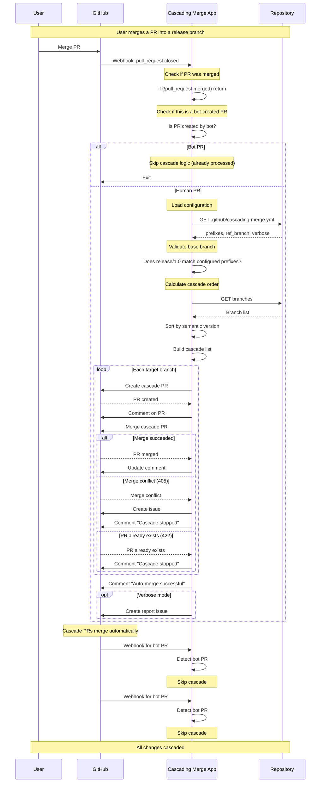

# Cascading Merge App - Sequence Diagram

This document illustrates how the Cascading Merge App processes pull requests and creates cascading merges across release branches.

## Complete Cascade Flow



## Configuration Example

```yaml
# .github/cascading-merge.yml
prefixes:
  - 'release/'
  - 'hotfix/'

ref_branch: 'main'

verbose: true  # Creates report issue with Mermaid diagram
```

## Verbose Report Output

When `verbose: true`, the app creates a GitHub Issue after cascade completion:

### Sample Report
---

## 🔄 Cascade Merge Report

## Trigger Information
- **Original PR**: #100
- **Merged Branch**: `feature/xyz` → `release/1.0`
- **Total Cascade PRs**: 3 created, 0 skipped

## Cascade PRs
| PR # | Source Branch | Target Branch | Status |
|------|---------------|---------------|--------|
| #101 | `release/1.0` | `release/1.1` | ✅ Created & Merged |
| #102 | `release/1.1` | `release/2.0` | ✅ Created & Merged |
| #103 | `release/2.0` | `main` | ✅ Created & Merged |

## Visual Flow

```mermaid
%%{init: {'gitGraph': {'mainBranchName': 'jefeish-patch-16'}}}%%
gitGraph
  commit id: "PR #100"

  branch "release/1.0"
  checkout "release/1.0"
  commit id: "Merged feature/xyz"

  branch "release/1.1"
  checkout "release/1.1"
  commit id: "PR #101"

  branch "release/2.0"
  checkout "release/2.0"
  commit id: "PR #102"

  checkout "main"
  commit id: "PR #103"
```
---

## Branch Ordering Algorithm

The app uses **semantic version sorting** to determine cascade order:

```
release/1.0
release/1.1
release/1.1-rc.1
release/1.2
release/2.0
release/2.0.1-alpha
release/2.0.1-beta
main (ref_branch)
```

This ensures changes flow from oldest to newest versions, ending at the final reference branch.
