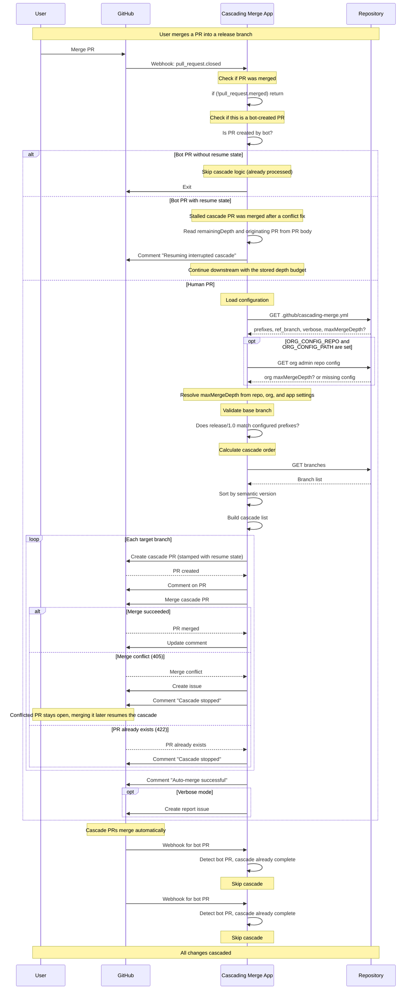
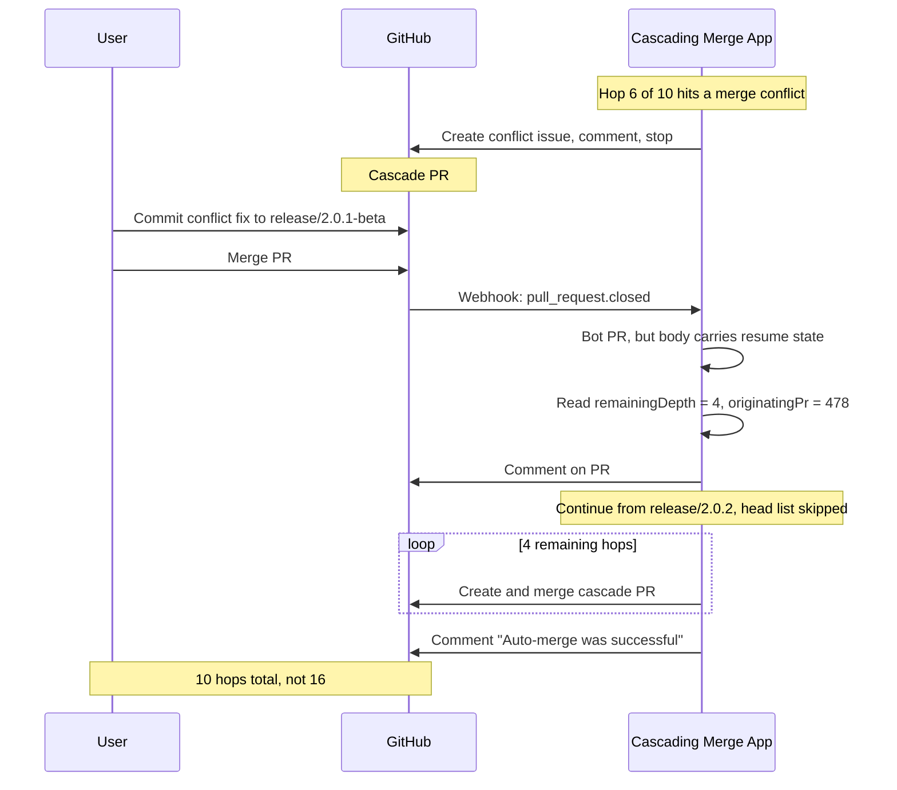
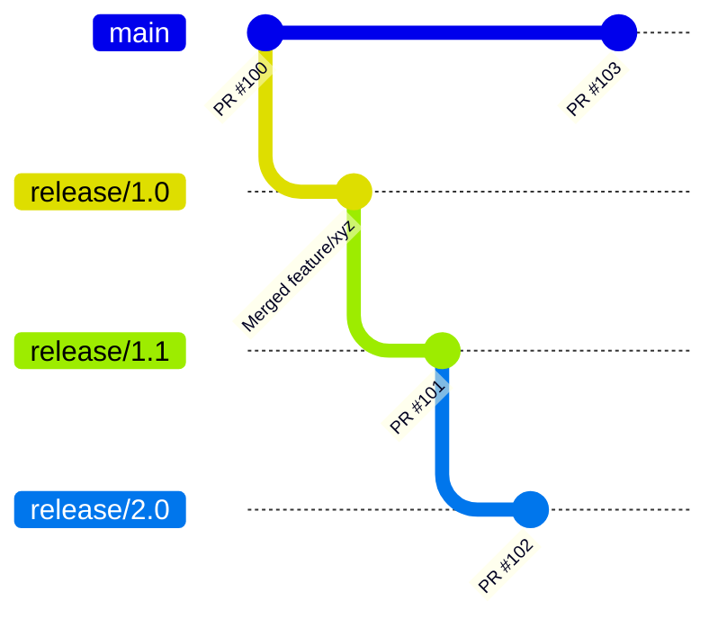

# Cascading Merge App - Sequence Diagram

This document illustrates how the Cascading Merge App processes pull requests and creates cascading merges across release branches.

## Complete Cascade Flow


```mermaid
sequenceDiagram
    participant User
    participant GitHub
    participant App as Cascading Merge App
    participant Repo as Repository

    Note over User,Repo: User merges a PR into a release branch

    User->>GitHub: Merge PR #100 into release/1.0
    GitHub->>App: Webhook: pull_request.closed

    Note over App: Check if PR was merged
    App->>App: if (!pull_request.merged) return

    Note over App: Check if this is a bot-created PR
    App->>App: Is PR created by bot?

    alt Bot PR without resume state
        Note over App: Skip cascade logic (already processed)
        App->>GitHub: Exit
    else Bot PR with resume state
        Note over App: Stalled cascade PR was merged after a conflict fix
        App->>App: Read remainingDepth and originating PR from PR body
        App->>GitHub: Comment "Resuming interrupted cascade"
        Note over App: Continue downstream with the stored depth budget
    else Human PR
        Note over App: Load configuration
        App->>Repo: GET .github/cascading-merge.yml
        Repo-->>App: prefixes, ref_branch, verbose, maxMergeDepth?

        opt ORG_CONFIG_REPO and ORG_CONFIG_PATH are set
            App->>Repo: GET org admin repo config
            Repo-->>App: org maxMergeDepth? or missing config
        end

        Note over App: Resolve maxMergeDepth from repo, org, and app settings

        Note over App: Validate base branch
        App->>App: Does release/1.0 match configured prefixes?

        Note over App: Calculate cascade order
        App->>Repo: GET branches
        Repo-->>App: Branch list
        App->>App: Sort by semantic version
        App->>App: Build cascade list

        loop Each target branch
            App->>GitHub: Create cascade PR (stamped with resume state)
            GitHub-->>App: PR created

            App->>GitHub: Comment on PR #100

            App->>GitHub: Merge cascade PR

            alt Merge succeeded
                GitHub-->>App: PR merged
                App->>GitHub: Update comment
            else Merge conflict (405)
                GitHub-->>App: Merge conflict
                App->>GitHub: Create issue
                App->>GitHub: Comment "Cascade stopped"
                Note over User,GitHub: Conflicted PR stays open, merging it later resumes the cascade
            else PR already exists (422)
                GitHub-->>App: PR already exists
                App->>GitHub: Comment "Cascade stopped"
            end
        end

        App->>GitHub: Comment "Auto-merge successful"

        opt Verbose mode
            App->>GitHub: Create report issue
        end
    end

    Note over GitHub: Cascade PRs merge automatically

    GitHub->>App: Webhook for bot PR #101
    App->>App: Detect bot PR, cascade already complete
    Note over App: Skip cascade

    GitHub->>App: Webhook for bot PR #102
    App->>App: Detect bot PR, cascade already complete
    Note over App: Skip cascade

    Note over User,Repo: All changes cascaded
```

## Resuming an Interrupted Cascade

When a cascade PR cannot be auto-merged, it stays open. Merging it after the conflict is resolved continues the run with the depth budget recorded in the PR body.


```mermaid
sequenceDiagram
    participant User
    participant GitHub
    participant App as Cascading Merge App

    Note over App: Hop 6 of 10 hits a merge conflict
    App->>GitHub: Create conflict issue, comment, stop
    Note over GitHub: Cascade PR #479 (release/2.0.1-beta -> release/2.0.2) stays open

    User->>GitHub: Commit conflict fix to release/2.0.1-beta
    User->>GitHub: Merge PR #479
    GitHub->>App: Webhook: pull_request.closed

    App->>App: Bot PR, but body carries resume state
    App->>App: Read remainingDepth = 4, originatingPr = 478
    App->>GitHub: Comment on PR #478 "Resuming interrupted cascade"

    Note over App: Continue from release/2.0.2, head list skipped
    loop 4 remaining hops
        App->>GitHub: Create and merge cascade PR
    end

    App->>GitHub: Comment "Auto-merge was successful"
    Note over User,GitHub: 10 hops total, not 16
```

## Configuration Example

```yaml
# .github/cascading-merge.yml
prefixes:
  - 'release/'
  - 'hotfix/'

# Optional: final reference merge target
# If omitted, no final reference merge is performed
ref_branch: 'main'

verbose: true # Creates report issue with Mermaid diagram
maxMergeDepth: 5 # Optional; omit for unlimited depth
                 # With ref_branch set, one final merge to ref_branch is still attempted after depth is reached
                 # Org-level and app-level maxMergeDepth values can cap this value
```

## Verbose Report Output

When `verbose: true`, the app creates a GitHub Issue after cascade completion:

### Sample Report

---

## 🔄 Cascade Merge Report

## Trigger Information

- **Original PR**: #100
- **Merged Branch**: `feature/xyz` → `release/1.0`
- **Total Cascade PRs**: 3 created, 0 skipped

## Cascade PRs

| PR # | Source Branch | Target Branch | Status              |
| ---- | ------------- | ------------- | ------------------- |
| #101 | `release/1.0` | `release/1.1` | ✅ Created & Merged |
| #102 | `release/1.1` | `release/2.0` | ✅ Created & Merged |
| #103 | `release/2.0` | `main`        | ✅ Created & Merged |

## Visual Flow


```mermaid
gitGraph
  commit id: "PR #100"

  branch "release/1.0"
  checkout "release/1.0"
  commit id: "Merged feature/xyz"

  branch "release/1.1"
  checkout "release/1.1"
  commit id: "PR #101"

  branch "release/2.0"
  checkout "release/2.0"
  commit id: "PR #102"

  checkout "main"
  commit id: "PR #103"
```

---

## Branch Ordering Algorithm

The app uses **semantic version sorting** to determine cascade order:

```
release/1.0
release/1.1
release/1.1-rc.1
release/1.2
release/2.0
release/2.0.1-alpha
release/2.0.1-beta
main (ref_branch)
```

This ensures changes flow from oldest to newest versions, ending at the final reference branch.
