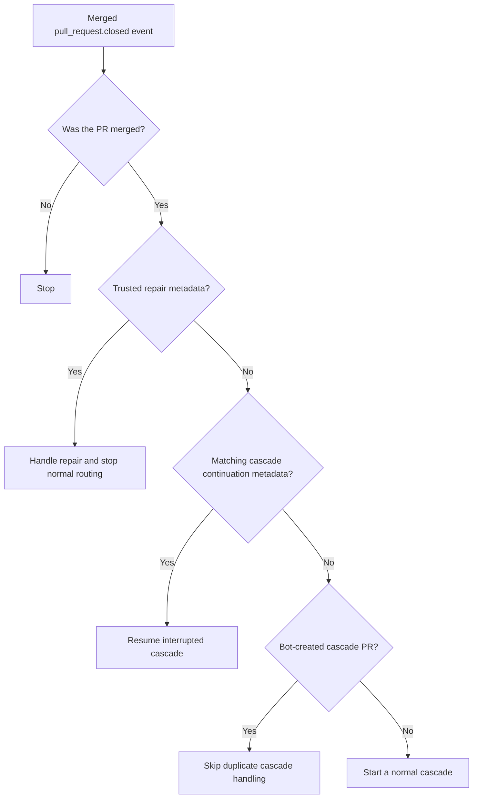
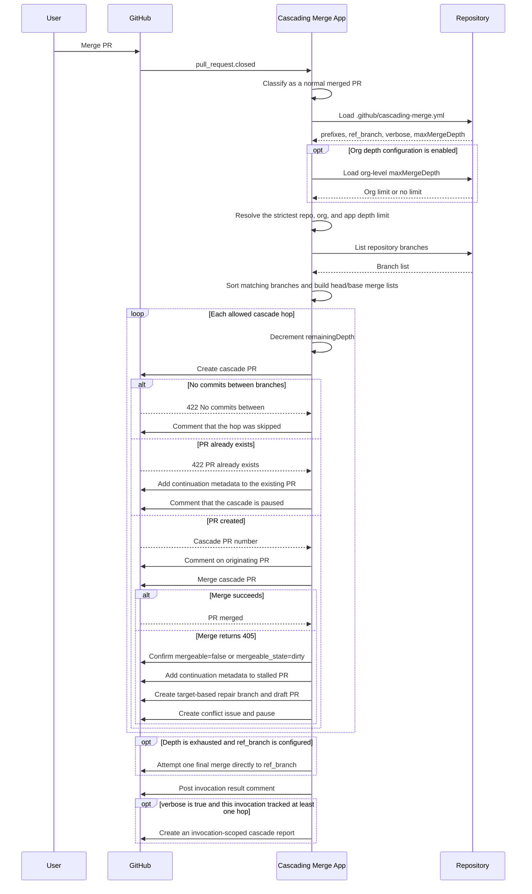
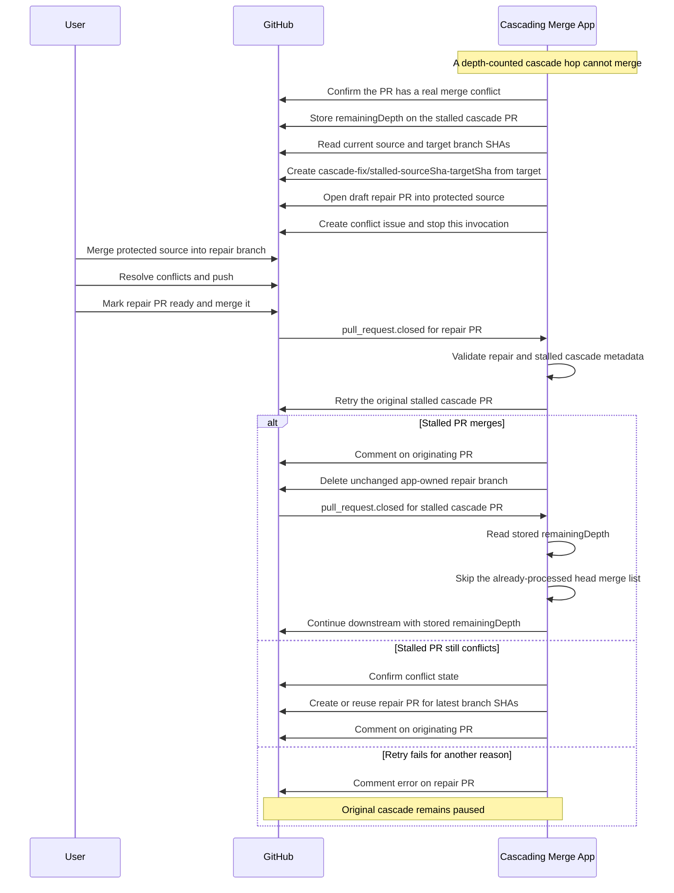

## Purpose

The Cascading Merge App reacts to merged pull requests and propagates changes
through ordered release branches. A cascade can pause on a conflict or an
existing pull request and later continue with the remaining depth recorded on
the stalled pull request.

The app is stateless between webhook deliveries. Hidden pull request metadata
provides the continuation and repair state.

## Pull request event routing

Every `pull_request.closed` event follows this order:


```mermaid
flowchart TD
    event[Merged pull_request.closed event] --> merged{Was the PR merged?}
    merged -- No --> stop[Stop]
    merged -- Yes --> repair{Trusted repair metadata?}
    repair -- Yes --> handleRepair[Handle repair and stop normal routing]
    repair -- No --> resume{Matching cascade continuation metadata?}
    resume -- Yes --> handleResume[Resume interrupted cascade]
    resume -- No --> bot{Bot-created cascade PR?}
    bot -- Yes --> skipBot[Skip duplicate cascade handling]
    bot -- No --> normal[Start a normal cascade]
```

A repair pull request is trusted only when:

- Its metadata matches its head and base branches
- Its creator is a bot
- Its head repository is the repository receiving the webhook

A continuation marker is accepted only when its recorded source and target
branches match the merged pull request.

## Normal cascade flow


```mermaid
sequenceDiagram
    participant User
    participant GitHub
    participant App as Cascading Merge App
    participant Repo as Repository

    User->>GitHub: Merge PR #100 into release/1.0
    GitHub->>App: pull_request.closed
    App->>App: Classify as a normal merged PR

    App->>Repo: Load .github/cascading-merge.yml
    Repo-->>App: prefixes, ref_branch, verbose, maxMergeDepth

    opt Org depth configuration is enabled
        App->>Repo: Load org-level maxMergeDepth
        Repo-->>App: Org limit or no limit
    end

    App->>App: Resolve the strictest repo, org, and app depth limit
    App->>Repo: List repository branches
    Repo-->>App: Branch list
    App->>App: Sort matching branches and build head/base merge lists

    loop Each allowed cascade hop
        App->>App: Decrement remainingDepth
        App->>GitHub: Create cascade PR

        alt No commits between branches
            GitHub-->>App: 422 No commits between
            App->>GitHub: Comment that the hop was skipped
        else PR already exists
            GitHub-->>App: 422 PR already exists
            App->>GitHub: Add continuation metadata to the existing PR
            App->>GitHub: Comment that the cascade is paused
        else PR created
            GitHub-->>App: Cascade PR number
            App->>GitHub: Comment on originating PR
            App->>GitHub: Merge cascade PR

            alt Merge succeeds
                GitHub-->>App: PR merged
            else Merge returns 405
                App->>GitHub: Confirm mergeable=false or mergeable_state=dirty
                App->>GitHub: Add continuation metadata to stalled PR
                App->>GitHub: Create target-based repair branch and draft PR
                App->>GitHub: Create conflict issue and pause
            end
        end
    end

    opt Depth is exhausted and ref_branch is configured
        App->>GitHub: Attempt one final merge directly to ref_branch
    end

    App->>GitHub: Post invocation result comment

    opt verbose is true and this invocation tracked at least one hop
        App->>GitHub: Create an invocation-scoped cascade report
    end
```

Successfully merged cascade pull requests do not carry continuation metadata.
Their later webhook deliveries are classified as ordinary bot pull requests and
skipped. The original webhook handler performs the cascade synchronously.

## Depth accounting

`maxMergeDepth` limits attempted cascade hops. The app decrements
`remainingDepth` before attempting to create each normal cascade pull request.
This means:

- A successfully merged hop consumes one depth unit
- A conflicted hop consumes one depth unit
- A `No commits between` hop consumes one depth unit
- A repair pull request consumes no depth
- Resuming a stalled pull request consumes no additional depth for the stalled
  hop because that hop was counted before it stalled
- `remainingDepth: null` means the cascade is unlimited

When `remainingDepth` reaches zero and `ref_branch` is configured, the app makes
one special final merge from the current release branch directly to
`ref_branch`. This forced final merge does not consume another depth unit.

### Example with a conflict

Given `maxMergeDepth: 5`:

| Action                                   | Depth before | Depth after | Counts toward limit    |
| ---------------------------------------- | ------------ | ----------- | ---------------------- |
| `release/0.1` to `release/1.1` conflicts | 5            | 4           | Yes                    |
| Repair PR into `release/0.1`             | 4            | 4           | No                     |
| Retry and merge the stalled PR           | 4            | 4           | No additional charge   |
| `release/1.1` to `release/1.1-rc.1`      | 4            | 3           | Yes                    |
| `release/1.1-rc.1` to `release/1.2`      | 3            | 2           | Yes                    |
| `release/1.2` to `release/2.0`           | 2            | 1           | Yes                    |
| `release/2.0` to `release/2.0.1-alpha`   | 1            | 0           | Yes                    |
| `release/2.0.1-alpha` to `development`   | 0            | 0           | No, forced final merge |

The logical run creates six cascade pull requests, but only five are
depth-counted. The sixth is the configured forced final merge.

## Conflict repair and continuation


```mermaid
sequenceDiagram
    participant User
    participant GitHub
    participant App as Cascading Merge App

    Note over App: A depth-counted cascade hop cannot merge
    App->>GitHub: Confirm the PR has a real merge conflict
    App->>GitHub: Store remainingDepth on the stalled cascade PR
    App->>GitHub: Read current source and target branch SHAs
    App->>GitHub: Create cascade-fix/stalled-sourceSha-targetSha from target
    App->>GitHub: Open draft repair PR into protected source
    App->>GitHub: Create conflict issue and stop this invocation

    User->>GitHub: Merge protected source into repair branch
    User->>GitHub: Resolve conflicts and push
    User->>GitHub: Mark repair PR ready and merge it
    GitHub->>App: pull_request.closed for repair PR

    App->>App: Validate repair and stalled cascade metadata
    App->>GitHub: Retry the original stalled cascade PR

    alt Stalled PR merges
        App->>GitHub: Comment on originating PR
        App->>GitHub: Delete unchanged app-owned repair branch
        GitHub->>App: pull_request.closed for stalled cascade PR
        App->>App: Read stored remainingDepth
        App->>App: Skip the already-processed head merge list
        App->>GitHub: Continue downstream with stored remainingDepth
    else Stalled PR still conflicts
        App->>GitHub: Confirm conflict state
        App->>GitHub: Create or reuse repair PR for latest branch SHAs
        App->>GitHub: Comment on originating PR
    else Retry fails for another reason
        App->>GitHub: Comment error on repair PR
        Note over App,GitHub: Original cascade remains paused
    end
```

The repair branch starts from the stalled pull request's target branch. This
ensures that the draft repair pull request has a real diff immediately. The
developer merges the protected source branch into the writable repair branch
and resolves the conflict there.

The stalled cascade pull request remains the only authority for:

- Originating pull request
- Source and target branch pair
- Remaining depth
- Effective maximum depth and its configuration source
- Final `ref_branch`

If the repair branch moves after its pull request merges, the app leaves it in
place rather than deleting an unexpected ref.

## Continuation metadata

Current continuation markers use version 2 and `kind: "cascade"`:

```text
<!-- cascading-merge-app:{"version":2,"kind":"cascade","originatingPr":478,"sourceBranch":"release/2.0.1-beta","targetBranch":"release/2.0.2","remainingDepth":4,"maxMergeDepth":10,"maxMergeDepthSource":"org","refBranch":"development"} -->
```

Repair markers use version 2 and `kind: "repair"` and reference the stalled pull
request. Version 1 continuation markers remain readable and are normalized to
the current in-memory representation.

When metadata is updated, the existing marker is replaced. The app rejects an
attempt to replace metadata belonging to a different cascade operation.

## Existing pull request collision

If GitHub reports that the source/target pull request already exists, the app:

1. Finds the open pull request for that exact branch pair.
2. Adds continuation metadata containing the current remaining depth.
3. Stops the current invocation.
4. Resumes from the stored state when that pull request is later merged.

The existing pull request performs the stalled depth-counted hop. Its later
merge does not consume that depth a second time.

## Final branch continuation

A stalled cascade pull request can target `ref_branch`, even though that branch
does not match a configured release prefix. The event router accepts this as a
terminal continuation when the target matches the `refBranch` recorded in
metadata.

After that stalled final pull request merges, the continuation has no
downstream release work. The app reports success without starting another
cascade.

## Verbose cascade reports

Reports are scoped to one invocation of `cascadingBranchMerge`; they are not an
aggregate view of the entire logical cascade.

An interrupted run therefore produces:

1. A report for the initial invocation, containing the pull requests attempted
   before the conflict
2. A second report for the continuation invocation, containing only the
   downstream work performed after the stalled pull request merged

To evaluate the logical run, combine both reports and apply the depth rules
above. For example, an initial report with one conflicted hop followed by a
continuation report with five rows can still respect `maxMergeDepth: 5`: the
continuation rows can represent four remaining depth-counted hops plus the
forced final `ref_branch` merge.

> [!WARNING]
> The current report table derives its status from creation tracking. A pull
> request that was created and then stalled by a conflict can be displayed as
> `Created & Merged` even though it remains open. The pull request's actual
> GitHub state is authoritative.

## Configuration example

```yaml
# .github/cascading-merge.yml
prefixes:
  - 'release/'
  - 'hotfix/'

ref_branch: 'development'
verbose: true
maxMergeDepth: 5
```

The effective maximum depth is the strictest configured repository,
organization, or app-level value. Resumed cascades inherit the effective depth
and source recorded when the cascade started.

## Branch ordering

The app tokenizes matching branch names on `/`, `-`, `+`, `_`, and `.` and sorts
numeric tokens numerically before comparing non-numeric tokens as ASCII text.
Only branches at or after the triggering branch participate.

Example order:

```text
release/1.0
release/1.1
release/1.1-rc.1
release/1.2
release/2.0
release/2.0.1-alpha
release/2.0.1-beta
development (ref_branch)
```
